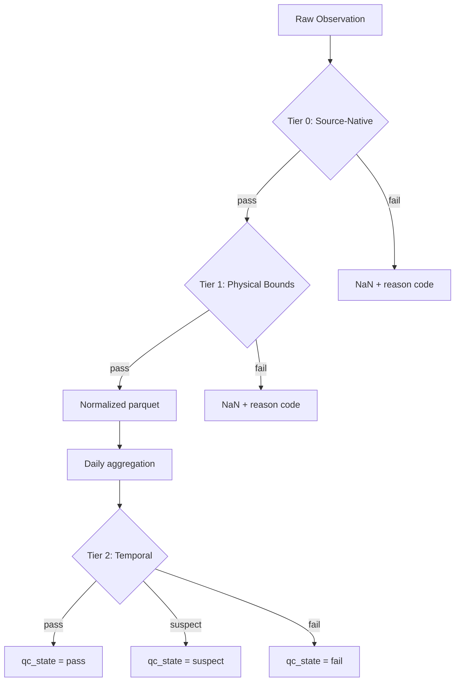
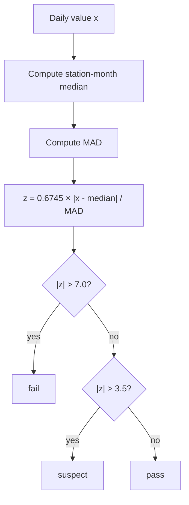

# MADIS Quality Control

## Philosophy

obsmet applies quality control in two distinct phases:

1. **Extract-time filtering** (Tiers 0–1) — applied during normalization, before data reaches
   any product. These are fast, per-observation checks that reject obviously bad values using
   source-native flags and physical plausibility limits. Values that fail are NaN'd immediately.

2. **Pipeline audit** (Tier 2) — applied when building station period-of-record products. These
   are temporal/statistical checks that require context beyond a single observation — a station's
   monthly distribution, consecutive-value runs, cross-variable consistency over daily windows.
   The Tier 2 methods are adapted from [agweather-qaqc](https://github.com/WSWUP/agweather-qaqc)
   (Dunkerly et al., 2024).

This separation exists because Tier 2 rules need aggregated data that doesn't exist at
extract time, and because keeping Tier 0–1 in the normalization step means that even raw
normalized parquets are usable without running the full QC pipeline.

## Tier 0: Source-Native Flags

MADIS attaches two QC indicators to every observation. obsmet uses both.

### DD (Data Descriptor) Flag

A single character summarizing the observation's upstream QC status:

| Flag | Meaning | obsmet Action |
|------|---------|---------------|
| `V` | Verified | **Accept** |
| `S` | Screened | **Accept** |
| `C` | Coarse pass | **Accept** |
| `G` | Subjectively good | **Accept** |
| `Q` | Questioned | **Reject** |
| `X` | Failed QC | **Reject** |
| `B` | Subjectively bad | **Reject** |
| `Z` | No QC applied | **Reject** |

### QCR (QC Results) Bitmask

MADIS runs a three-level internal QC chain. The QCR field is a bitmask where each set bit
indicates a *failed* check:

| Bit | Value | Check | Strict Profile | Permissive Profile |
|-----|-------|-------|----------------|-------------------|
| 1 | 1 | Master check failure | **Reject** | Accept |
| 2 | 2 | Validity bounds | **Reject** | **Reject** |
| 4 | 8 | Internal consistency (Td > T) | Accept | Accept |
| 5 | 16 | Temporal consistency | **Reject** | Accept |
| 6 | 32 | Statistical spatial consistency | **Reject** | Accept |
| 7 | 64 | Spatial buddy check (OI-based) | **Reject** | Accept |

The **strict** profile uses `qcr_mask = 115` (bits 1+2+16+32+64), rejecting on master,
validity, temporal, and both spatial checks. This matches the operational MADIS QC posture.

The **permissive** profile uses `qcr_mask = 2` (bit 2 only), rejecting only validity failures.
This maximizes station coverage for applications like ML training where more data is preferred
over stricter filtering.

!!! note "Why skip bit 4 (internal consistency)?"
    Bit 4 flags cases where dewpoint exceeds air temperature. obsmet handles this separately
    via the DewpointConsistencyRule in Tier 1, which applies a configurable tolerance
    (default 0.5°C) rather than a hard reject. This avoids over-filtering co-reported variables
    from a single sensor package.

## Tier 1: Physical Bounds

Applied to every observation regardless of source. These are intentionally generous limits —
they reject physically impossible values, not merely unusual ones.

### PhysicalBoundsRule

| Variable | Min | Max | Unit |
|----------|-----|-----|------|
| `tair`, `tmin`, `tmax`, `tmean` | -90 | 60 | °C |
| `td` | -100 | 50 | °C |
| `rh` | 0 | 100 | % |
| `ea` | 0 | 10 | kPa |
| `vpd` | 0 | 15 | kPa |
| `wind`, `u2` | 0 | 120 | m/s |
| `u`, `v` | -120 | 120 | m/s |
| `wind_dir` | 0 | 360 | ° |
| `psfc` | 30,000 | 110,000 | Pa |
| `slp` | 85,000 | 110,000 | Pa |
| `rsds` | 0 | 50 | MJ/m²/day |
| `rsds_hourly` | 0 | 1,400 | W/m² |
| `prcp` | 0 | 1,000 | mm |

### DewpointConsistencyRule

Checks that dewpoint does not exceed air temperature by more than a tolerance (default 0.5°C).
Physically, dewpoint cannot exceed air temperature; the tolerance allows for measurement
uncertainty.

**Condition:** `td > tair + 0.5` → **fail**

## Tier 2: Temporal QC

Applied during station POR building, after daily aggregation. These rules use a station's own
history to detect problems that single-observation checks cannot catch.

### MonthlyZScoreRule

**What it detects:** Outlier values that are statistically implausible given a station's
historical distribution for that calendar month.

**How it works:** For each station-variable-month combination, compute the median and MAD
(Median Absolute Deviation) from all available observations. Then for each value, compute a
modified z-score:

$$
z = \frac{0.6745 \times |x - \tilde{x}|}{\text{MAD}}
$$

where $\tilde{x}$ is the median. The 0.6745 constant makes the z-score comparable to a
standard normal distribution.

**Thresholds:**

| Threshold | z-score | Action |
|-----------|---------|--------|
| Suspect | > 3.5 | Flag as suspect |
| Fail | > 7.0 | Flag as fail |

**Requirements:** At least 90 observations per station-month and 90 total observations for the
station-variable. If insufficient data, the rule passes by default (cannot make a statistical
judgment).

### StuckSensorRule

**What it detects:** Sensors reporting the same value repeatedly, indicating hardware failure
or communication dropout where the last valid reading is repeated.

**How it works:** Identifies runs of N or more consecutive identical values. Zero values are
exempt (e.g., zero precipitation on consecutive dry days is normal).

**Thresholds:**

| Granularity | Min run length |
|-------------|---------------|
| Daily | 5 consecutive days |
| Hourly | 12 consecutive hours |

### DewpointTemperatureRule (Daily)

**What it detects:** Days where the mean dewpoint exceeds the daily minimum temperature,
suggesting sensor drift or systematic miscalibration.

**How it works:** For each day, checks whether `td_mean > tmin + 1.0°C`. This is stricter
than the hourly Tier 1 check (which allows 0.5°C tolerance) because daily averaging should
smooth out transient exceedances.

**Condition:** `td > tmin + 1.0` → **fail**

### IsolatedObsRule (Hourly Only)

**What it detects:** Isolated observations with no valid neighbor within ±6 hours, suggesting
data recording artifacts rather than genuine measurements.

**Note:** This rule applies only to hourly data and is not meaningful for daily series.

### RHDriftRule

**What it detects:** Slow humidity sensor drift causing RHmax to systematically under-report.

**How it works:** Wraps agweather-qaqc's `rh_yearly_percentile_corr`. Assumes that in
agricultural areas, RHmax should reach ~100% at least once per year (e.g., rain events).
For each year, computes a multiplicative correction factor from the top 1% of RHmax values.
The magnitude of the correction indicates drift severity.

**Thresholds:**

| Correction factor | Action |
|-------------------|--------|
| 1.05–1.15 (or reciprocal) | Flag year as suspect |
| > 1.15 (or reciprocal) | Flag year as fail |
| < 1.05 | Pass (sensor operating normally) |

**Requirements:** At least 365 days of data for meaningful yearly percentile calculation.

### RsPeriodRatioRule

**What it detects:** Solar radiation spikes (electrical shorts, datalogger errors) and
sensor drift causing systematic over- or under-reporting of Rs.

**How it works:** Wraps agweather-qaqc's `rs_period_ratio_corr`. Divides the station record
into 60-day periods and computes a correction factor (Rso/Rs) from the 6 largest Rs/Rso
ratios per period. Two rules detect spikes within each period:

1. **Sensitivity rule:** Removing any single ratio shifts the correction factor by >2%.
2. **Absolute rule:** Average Rs exceeds average Rso by ≥75 W/m².

Clear-sky Rso comes from pre-computed RSUN terrain-corrected rasters (GRASS r.sun +
r.horizon) rather than the flat-earth refet Rso that agweather-qaqc uses natively.

**Thresholds:**

| Condition | Action |
|-----------|--------|
| Value removed by spike detector or insufficient data | fail |
| Correction changes value by >10% | suspect |
| Correction factor outside 0.50–1.50 | fail (period removed) |
| Correction factor within 0.97–1.03 | pass (no correction needed) |

## QC Profiles

obsmet provides two pre-configured QC profiles that control Tier 0 filtering aggressiveness:

| Profile | QCR Mask | What it rejects | When to use |
|---------|----------|----------------|-------------|
| **strict** | 115 | Master, validity, temporal, spatial, buddy failures | Operational products, climatological analysis |
| **permissive** | 2 | Validity failures only | ML training data, maximum coverage studies |

Both profiles apply identical Tier 1 and Tier 2 rules. The difference is only in how
aggressively source-native MADIS QC flags are used to filter observations at extract time.

## QC Output Columns

Every observation in obsmet output carries two QC columns:

| Column | Type | Description |
|--------|------|-------------|
| `qc_state` | string | Aggregate QC verdict: `pass`, `suspect`, `fail`, or `missing` |
| `qc_reason_codes` | string | Comma-separated machine-readable codes from all rules that fired |

**Aggregation precedence:** When multiple rules evaluate the same observation, the worst state
wins: `fail` > `suspect` > `pass`.

Example reason codes: `madis_dd_reject`, `madis_qcr_bit2`, `bounds_tair`, `dewpoint_gt_tair`,
`zscore_suspect_tair`, `stuck_sensor_wind`.

## Complementarity: Spatial vs. Temporal

obsmet's QC system is primarily **temporal and station-centric** — it uses a station's own
history to judge its current readings. This is complementary to **spatial** QC systems like
NOAA's RTMA/GSI, which compare each observation against its neighbors and a model background
field.

| Dimension | Spatial QC (RTMA/GSI) | Temporal QC (obsmet) |
|-----------|----------------------|---------------------|
| Scope | All stations simultaneously | One station at a time |
| Time window | Single hour | Months to years |
| Catches | Spatially inconsistent obs (broken anemometer during windstorm) | Instrument drift, distributional shift, stuck sensors |
| Decision basis | Innovation vs. background field | Station's own history |
| Update frequency | Hourly (reject lists: periodic) | Retrospective / batch |

These systems catch different failure modes. A station with a slowly drifting humidity sensor
will pass spatial checks (its readings are plausible hour-by-hour) but fail temporal checks
(its monthly distribution shifts over time). Conversely, a station producing correct but
spatially inconsistent readings (e.g., a cold-air pool station during an inversion) would fail
spatial checks but pass temporal ones.

## Citation

The temporal QC methods in obsmet are adapted from the agweather-qaqc package:

> Dunkerly, C., Huntington, J. L., McEvoy, D., Morway, A., & Allen, R. G. (2024).
> agweather-qaqc: An Interactive Python Package for Quality Assurance and Quality Control of
> Daily Agricultural Weather Data and Calculation of Reference Evapotranspiration. *Journal
> of Open Source Software*, 9(97), 6368.
> [doi:10.21105/joss.06368](https://doi.org/10.21105/joss.06368)
