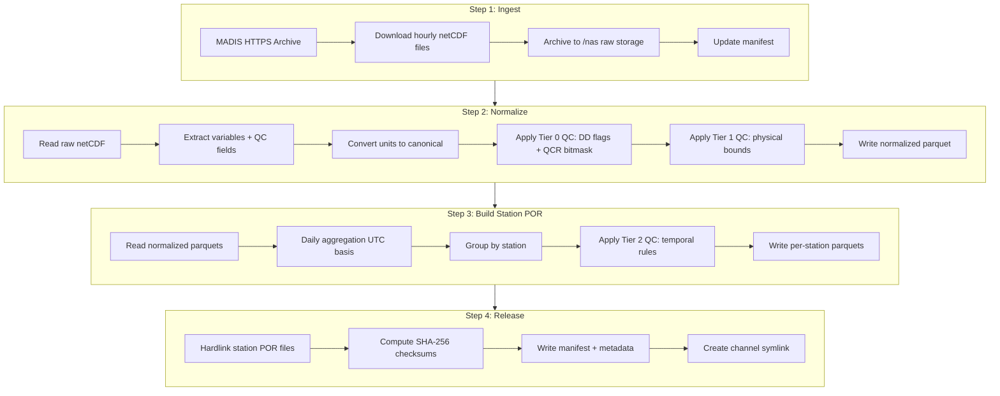
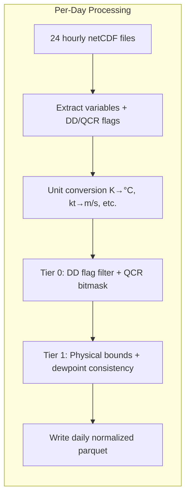
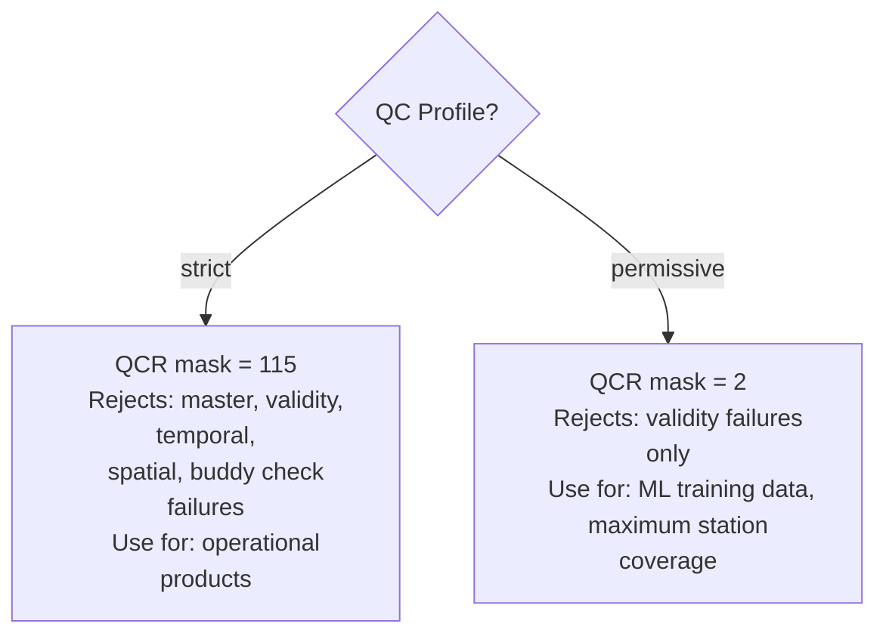
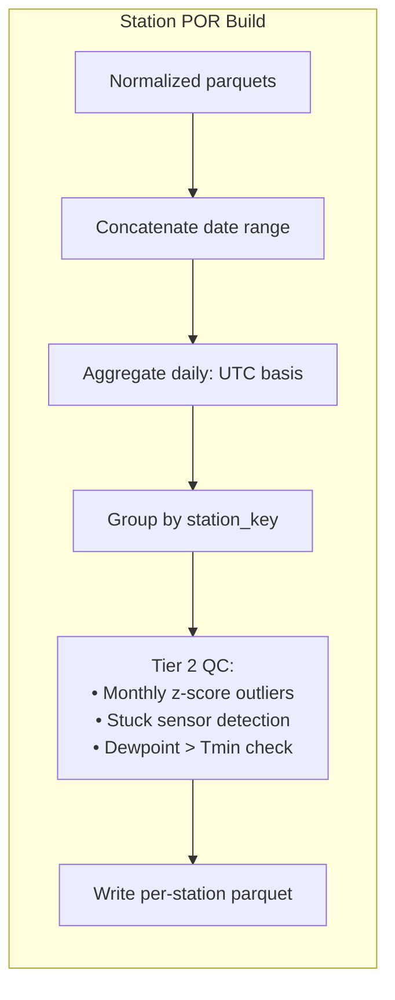
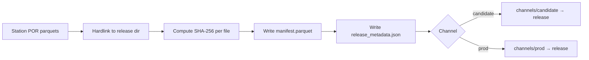

# MADIS Workflow

## What You Get

At the end of this pipeline, you have:

- **Per-station daily parquets** with quality-controlled observations (temperature, dewpoint,
  humidity, wind, precipitation, solar radiation)
- **Tiered QC annotations** on every value — source-native flags, physical bounds, temporal
  statistics — with machine-readable reason codes
- **Versioned releases** with SHA-256 checksums and full provenance (raw file hash, ingest run
  ID, QC rules version)
- **Channel symlinks** (candidate, prod) for reproducible downstream references

## Pipeline Overview



## Step 1: Ingest

**What happens:** obsmet downloads hourly gzip-compressed netCDF files from the MADIS Research
archive over HTTPS. Downloads are parallelized with `aria2c`. A manifest tracks the state of
every file (done, missing, failed, skipped), enabling resume after interruption.

**CLI command:**

```bash
uv run obsmet ingest madis --start 2018-01-01 --end 2024-12-31 --workers 4
```

**Key flags:**

| Flag | Default | Purpose |
|------|---------|---------|
| `--start` / `--end` | required | Date range to download |
| `--workers` | 4 | Parallel download connections |
| `--resume` / `--no-resume` | resume | Skip files already marked done in manifest |
| `--overwrite` | off | Re-download even if file exists |
| `--dry-run` | off | Show what would be downloaded without doing it |

**Output:** Raw netCDF files at `/nas/climate/obsmet/raw/madis/YYYY/MM/DD/YYYYMMDD_HHMM.gz`

## Step 2: Normalize

**What happens:** Each raw netCDF file is parsed, variables are extracted, units are converted
to the canonical system, and two tiers of quality control are applied inline. The result is
one normalized parquet per day containing all stations and hours.



### QC Profile Selection

The `--qc-profile` flag controls how aggressively source-native QC filters observations:



**CLI command:**

```bash
uv run obsmet normalize madis --start 2018-01-01 --end 2024-12-31 \
    --qc-profile strict --workers 4
```

**Key flags:**

| Flag | Default | Purpose |
|------|---------|---------|
| `--qc-profile` | strict | `strict` (full operational QC) or `permissive` (validity only) |
| `--qcr-mask` | 115 | Override QCR reject bitmask directly |
| `--bounds` | none | Spatial filter as `west,south,east,north` |
| `--workers` | 4 | Parallel processing workers |

**Output:** Normalized parquets at `/nas/climate/obsmet/normalized/madis/YYYY/YYYY-MM-DD.parquet`

## Step 3: Build Station POR

**What happens:** Normalized hourly parquets are read, aggregated to daily values (UTC midnight
boundaries), grouped by station, and passed through Tier 2 temporal QC rules. The output is one
parquet per station covering its full period of record.



**Daily aggregation rules:**

| Variable | Aggregation | Column |
|----------|------------|--------|
| Air temperature | max, min, mean | `tmax`, `tmin`, `tmean` |
| Dewpoint | mean | `td` |
| Relative humidity | mean | `rh` |
| Vapor pressure | mean from hourly ea | `ea` |
| VPD | mean from hourly vpd | `vpd` |
| Wind speed | mean, adjusted to 2m | `u2` |
| Solar radiation | daily total (W/m² → MJ/m²/day) | `rsds` |
| Precipitation | daily sum | `prcp` |

**CLI command:**

```bash
uv run obsmet build station-por --source madis --start 2018-01-01 --end 2024-12-31
```

**Output:** Per-station parquets at `/nas/climate/obsmet/products/station_por/madis/{station_key}.parquet`

## Step 4: Release

**What happens:** Station POR files are hardlinked into a versioned release directory.
SHA-256 checksums are computed for every file. A release manifest (parquet) and metadata
file (JSON) are written. A channel symlink is created pointing to the release.



**Release lifecycle:**

1. **Build** — create the versioned snapshot as a candidate
2. **Validate** — verify all checksums match, row counts are consistent
3. **Promote** — point the prod channel at the validated release

**CLI commands:**

```bash
# Build a candidate release
uv run obsmet release build --version 2.1 --channel candidate \
    --source madis --qc-profile strict

# Validate checksums
uv run obsmet release validate --version 2.1

# Promote to production
uv run obsmet release promote --version 2.1 --channel prod
```

**Output directory structure:**

```
/nas/climate/obsmet/releases/v2.1/
├── release_metadata.json
├── manifest.parquet
└── station_por/
    └── madis/
        ├── KMSO.parquet
        ├── KBOI.parquet
        └── ...
```

## Artifact Inventory

| Artifact | Format | Location | Build Command |
|----------|--------|----------|---------------|
| Raw hourly files | netCDF (gzip) | `raw/madis/YYYY/MM/DD/` | `obsmet ingest madis` |
| Normalized daily obs | Parquet | `normalized/madis/YYYY/` | `obsmet normalize madis` |
| Station POR | Parquet (per station) | `products/station_por/madis/` | `obsmet build station-por` |
| Release snapshot | Parquet + JSON | `releases/v<X>/` | `obsmet release build` |
| Release manifest | Parquet | `releases/v<X>/manifest.parquet` | `obsmet release build` |
| Channel symlink | Symlink | `channels/{candidate,prod}` | `obsmet release promote` |

## Example: PNW 2018–2024

A complete workflow for Pacific Northwest MADIS observations, 2018 through 2024:

```bash
# 1. Download raw hourly files (~7 years × 8,760 hours)
uv run obsmet ingest madis --start 2018-01-01 --end 2024-12-31 --workers 4

# 2. Normalize with strict QC profile, filtered to PNW bounding box
uv run obsmet normalize madis --start 2018-01-01 --end 2024-12-31 \
    --qc-profile strict --bounds "-125,42,-104,49" --workers 4

# 3. Build station period-of-record daily parquets with Tier 2 QC
uv run obsmet build station-por --source madis --start 2018-01-01 --end 2024-12-31

# 4. Build a versioned release
uv run obsmet release build --version 1.0 --channel candidate \
    --source madis --qc-profile strict

# 5. Validate and promote
uv run obsmet release validate --version 1.0
uv run obsmet release promote --version 1.0 --channel prod
```

After promotion, downstream consumers reference the release as:

```
/nas/climate/obsmet/channels/prod/station_por/madis/{station_key}.parquet
```

This path is stable — it always points to the current production release regardless of version
number.
