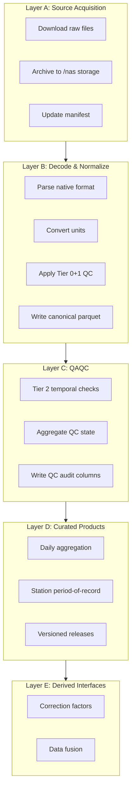

# Architecture Overview

## The Problem

Surface meteorological observations are scattered across dozens of federal, state, and
cooperative networks. Each uses different file formats, variable names, units, QC conventions,
and access methods. Researchers who need consistent, quality-controlled station data typically
build one-off extraction scripts per source, apply ad hoc filters, and lose track of which
version of which QC rules produced which output. The result is fragile pipelines, irreproducible
analyses, and wasted effort.

obsmet exists to solve this: one system that ingests from all major surface observation networks,
normalizes everything to a common schema, applies structured quality control, and produces
versioned, checksummed outputs with full provenance.

## Pipeline Architecture

obsmet processes observations through five layers, each with a clear responsibility boundary:



## Layer Descriptions

### Layer A: Source Acquisition

**What it does:** Downloads raw observation files from remote archives and stores them locally
with a manifest tracking download state.

**Why it exists:** Each source has different access methods (HTTPS, FTP, API), authentication
requirements, file naming conventions, and failure modes. Layer A isolates all of this behind
a common manifest-driven interface with resume semantics — if a download is interrupted, it
picks up where it left off.

**Outputs:** Raw files (netCDF, CSV, BUFR) at source-specific paths under `/nas/climate/`

### Layer B: Decode & Normalize

**What it does:** Parses source-native formats, extracts meteorological variables, converts
units to the canonical system, and applies immediate QC (source-native flags + physical bounds).

**Why it exists:** A MADIS netCDF, an ISD CSV, and a GDAS BUFR file all contain air temperature,
but they encode it differently (variable names, units, missing-value conventions, QC flag
formats). Layer B produces a uniform output regardless of source: same column names, same units,
same QC state vocabulary.

**Outputs:** Normalized parquets under `/mnt/mco_nas1/shared/obsmet/normalized/<source>/`

### Layer C: QAQC

**What it does:** Applies temporal quality control rules that require context beyond a single
observation — monthly z-score outlier detection, stuck-sensor checks, dewpoint-temperature
consistency over daily windows.

**Why it exists:** Source-native QC (Tier 0) and physical bounds (Tier 1) catch obviously bad
values, but miss subtler problems: slow sensor drift, intermittent stuck readings, systematic
biases. Tier 2 rules use a station's own history to detect these patterns.

**Outputs:** QC-annotated parquets under `/mnt/mco_nas1/shared/obsmet/qaqc/<source>/`

### Layer D: Curated Products

**What it does:** Aggregates quality-controlled observations into researcher-ready products —
daily summaries, station period-of-record files, and versioned releases with checksums and
metadata.

**Why it exists:** Downstream consumers (bias-correction models, climatological analyses,
irrigation scheduling) need daily values per station, not hourly multi-source parquets.
Layer D also provides immutable, versioned releases so that analyses are reproducible:
"this paper used obsmet release v2.1 from the prod channel."

**Outputs:** Products under `/mnt/mco_nas1/shared/obsmet/products/`, releases under `/mnt/mco_nas1/shared/obsmet/releases/`

### Layer E: Derived Interfaces (Future)

**What it does:** Will compute correction factors, station-to-grid fusion products, and
cross-source composites.

**Why it exists:** Some consumers need not raw observations but derived quantities — e.g.,
monthly multiplicative bias between station observations and a gridded product, used as training
targets for spatial models.

**Outputs:** Artifacts under `/mnt/mco_nas1/shared/obsmet/artifacts/`

## Design Principles

| Principle | What it means | Why it matters |
|-----------|---------------|----------------|
| **UTC-only** | All timestamps and daily aggregations use UTC midnight boundaries | Eliminates timezone ambiguity across networks spanning multiple zones |
| **Strict provenance** | Every output row carries `ingest_run_id`, `raw_file_hash`, `qc_rules_version` | Any output value can be traced back to its exact raw source and processing version |
| **Immutable releases** | Released products are hardlinked snapshots with SHA-256 checksums | Analyses referencing a release version are reproducible indefinitely |
| **Resume semantics** | Manifests track per-file state; interrupted jobs restart from where they stopped | Long ingest runs (years of hourly data) survive network failures gracefully |
| **Tiered QC** | Source-native (Tier 0) → physical bounds (Tier 1) → temporal statistics (Tier 2) | Each tier catches different failure modes; tiers compose without interference |

## Storage Layout

Raw data lives at source-specific paths under `/nas/climate/`. Normalized outputs and
products are written to a shared directory on the office NAS.

### Raw Data (Layer A)

```
/nas/climate/
├── madis/LDAD/mesonet/netCDF/   # Hourly gzip netCDF, 2001–present
├── isd/raw/                      # Station-year .gz files from S3
├── gdas/prepbufr/                # BUFR archives + pre-extracted parquet
│   ├── YYYY/prepbufr.YYYYMMDD.nr.tar.gz
│   └── parquet/YYYY/YYYYMMDD.parquet   # Pre-extracted fast path
├── raws/wrcc/station_data/       # Per-station daily CSVs
└── ndbc/ndbc_records/            # Per-station hourly parquets
```

### Normalized + Products (Layers B–D)

```
/mnt/mco_nas1/shared/obsmet/
├── normalized/                 # Layer B output
│   ├── madis/
│   ├── isd/
│   ├── gdas/
│   ├── raws_wrcc/
│   └── ndbc/
├── products/                   # Layer D output
│   ├── daily/
│   └── station_por/
├── releases/                   # Versioned snapshots
│   └── v<version>/
│       ├── release_metadata.json
│       ├── manifest.parquet
│       └── station_por/<source>/
├── channels/                   # Symlinks to active releases
│   ├── candidate → ../releases/v<X>
│   └── prod → ../releases/v<Y>
└── artifacts/                  # Layer E output (future)
    ├── crosswalks/
    ├── diagnostics/
    └── correction_factors/
```
